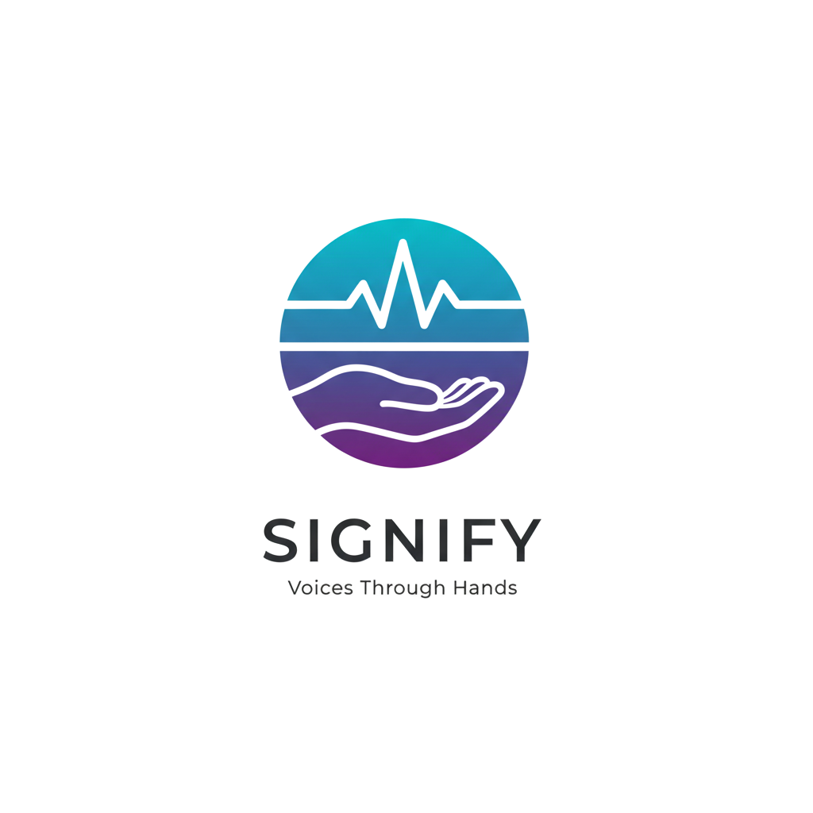

  

<h1 align="center">Signify: Traduzione ASL in Tempo Reale</h1>

  <strong>Un ponte tra la lingua dei segni e il linguaggio parlato attraverso Deep Learning e Computer Vision.</strong>

  

---

## 🌟 Visione del Progetto
**Signify** nasce con l'obiettivo di rendere la comunicazione inclusiva accessibile a chiunque disponga di una semplice webcam. Sfruttando le potenzialità del Deep Learning moderno, il sistema è in grado di interpretare la **Lingua dei Segni Americana (ASL)** e trasformarla in testo strutturato, garantendo fluidità e correttezza semantica.

---

## 🧠 Come Funziona: Il Motore Tecnologico
Signify non è solo un classificatore di immagini, ma un ecosistema ibrido che lavora in tre fasi distinte per garantire precisione e velocità:

### 1. Estrazione Spaziale (MediaPipe)
Il cuore della visione è affidato a **MediaPipe Holistic**. Invece di processare pesanti flussi video, il sistema estrae in tempo reale i **landmark 3D** di mani, viso e posa. Questo approccio garantisce:
*   **Privacy**: Le immagini video rimangono sul dispositivo dell'utente e non vengono mai caricate.
*   **Efficienza**: La riduzione del video a soli 543 punti chiave permette il funzionamento anche su dispositivi mobile.

### 2. Modellazione Temporale (LSTM + Attention)
I punti chiave estratti vengono processati da una rete neurale ricorrente **LSTM (Long Short-Term Memory)** potenziata da un meccanismo di **Attention**. Questa architettura permette al modello di:
*   Identificare quali frame sono cruciali per distinguere un segno dall'altro.
*   Gestire la dinamicità e la velocità variabile dell'esecuzione dei segni.

### 3. Perfezionamento Semantico (NLP BERT Corrector)
La lingua dei segni ha una grammatica propria. Per rendere la traduzione naturale, Signify integra un correttore basato su **BERT**. Questo modulo NLP analizza la sequenza di segni prodotti e:
*   Suggerisce la parola più probabile basandosi sul contesto della frase.
*   Corregge eventuali errori di classificazione visiva attraverso la probabilità linguistica.

---

## 📸 Interfaccia Live

  

---

## 📂 Organizzazione della Repository
La struttura è stata pensata per separare chiaramente la ricerca scientifica dal prodotto web:

*   📂 **webapp/**: Il cuore interattivo del progetto. Contiene il frontend React e l'engine ONNX per la traduzione live.
*   📂 **documentazione/**:
    *   `relazione_tecnica/`: La tesi completa in PDF con tutti i dettagli matematici e i risultati sperimentali.
    *   `presentazione/`: Slide utilizzate per illustrare il progetto.
*   📂 **src/ & notebooks/**: L'intero laboratorio di ricerca. Include gli script PyTorch per il training e i notebook Jupyter per l'analisi dei dati e la generazione dei grafici.
*   📂 **media/**: Asset grafici per la presentazione del progetto.

---

## 📈 Risultati e Documentazione
Il modello è stato addestrato sul dataset *ASL Citizen*, raggiungendo elevate performance su un vocabolario di oltre **2.300 segni**. Tutti i grafici di accuratezza, le matrici di confusione e le analisi comparative tra i modelli sono disponibili nella documentazione tecnica.

👉 **[Leggi la Relazione Tecnica Completa](documentazione/relazione_tecnica/Signify_Technical_Report.pdf)**

---

## 🎓 Sviluppo
Sviluppato da **Antonio Walter De Fusco** presso l'Università degli Studi di Salerno. Il progetto vuole essere una prova di concetto (PoC) di come l'AI possa essere messa al servizio di problematiche reali, migliorando la qualità della vita e l'inclusione sociale.

  <em>Creato per abbattere barriere, un segno alla volta.</em>

